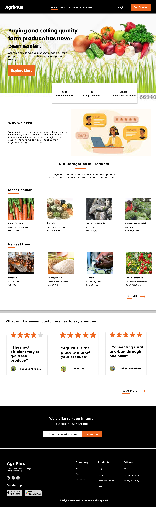

# AgriPlus Website

<q>This is a static website, build for educational purposes on CSS and HTML.</q>

<i>⚠⚠⚠ Disclaimer!!! ⚠⚠⚠⚠</i>

This website is only fit for screens 1200px and above.

<em>The product isn't responsive</em>

<i>♥♥♥♥♥ Try out your luck by cloning it and make it responsive. ♥♥♥♥♥</i>

AgriPlus is here to have you sorted, you can order farm produce from the farmers, harvesters, and producers directly. 

[Click to view live page](https://g-okumu.github.io/agriplus/)

        Build By~/ George Okumu
        - Fullstack Engineer and Mentor

<h3>Technologies used</h3>

1. HTML 5
2. CSS 3
3. Font Awesome Icons(Make sure you download it from them website)

<em>Incase you need mentoring in Frontend Development or need priducts to be built, reach out to me via[email](gokumu368@gmail.com) or [LinkedIn](https://www.linkedin.com/in/george-okumu-378997195/)</em>